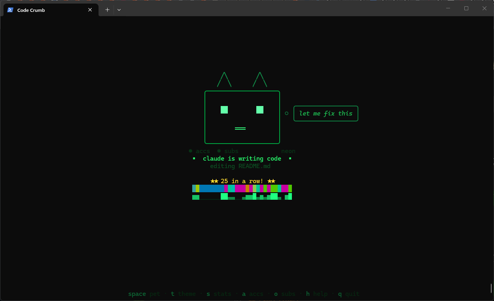
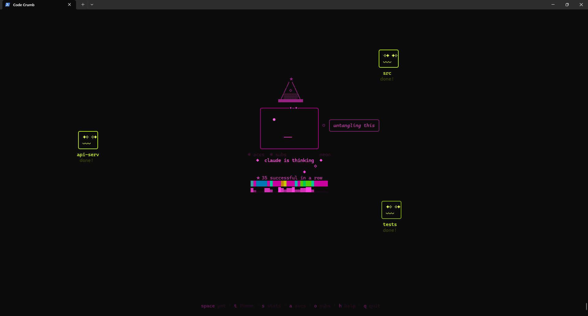

# Code Crumb

A terminal tamagotchi that shows what your AI coding assistant is doing.



Code Crumb hooks into AI coding tool lifecycle events and displays an animated face that reacts in real time — blinking, searching, coding, celebrating, and occasionally glitching when things go wrong.

**Supported editors:** Claude Code, OpenAI Codex CLI, OpenCode, OpenClaw/Pi — and any tool that can pipe JSON events.

Zero dependencies. Just Node.js and vibes.

## Thought Bubbles

The face shows a tiny thought bubble with contextual content:


Content adapts to what's happening: file count when editing multiple files, tool call number, session duration, or idle flavor text ("thinking about types", "contemplating recursion").

## Streaks & Achievements

A persistent counter tracks consecutive successful tool calls. The face gets increasingly confident during long streaks, and when a build finally fails, the reaction is proportional to how long the streak was — first error after 50 successes? *DEVASTATION.* Milestones at 10, 25, 50, 100, 200, and 500 trigger sparkle celebrations. Stats persist across sessions in `~/.code-crumb-stats.json`.


## Session Timeline

A thin color-coded bar underneath the face shows a visual history of the session:

```
  ████░░████████▓▓▓▓░░████████████████
```

Each color maps to a state — purple for thinking, green for coding, red for errors, gold for happy, teal for satisfied, green-gold for proud, amber for relieved. At a glance you can see how the session went: lots of red? rough session. smooth green? clean run. It's a tiny EKG for your AI.

## Orbital Subagents

When your session spawns subagents (e.g. Claude Code's `Task` tool), mini-faces orbit the main face like satellites — each with its own state, expression, and label:



- Mini-faces orbit on an elliptical path, slowly rotating as a constellation
- Faint dotted connection lines pulse outward from the main face to each orbital
- The main face adopts a **conducting** expression — eyes scanning between subagents, stream particles radiating outward
- Dynamic slot count based on terminal size (up to 8 orbitals; graceful degradation on small terminals)
- Toggle orbital visibility with `o` key
- Sessions appear when subagents start, linger briefly after they stop, then fade away
- Labels derived from working directory — sessions in different directories show folder names, same-directory sessions get `sub-N` labels


## Expressions

| State | Eyes | Mouth | Trigger | Vibe |
|---|---|---|---|---|
| **Idle** | `██ ██` + blinking | `◡◡◡` | No activity | Calm, breathing, floating particles |
| **Thinking** | `● ●` (rotating) | `───` | Between tool calls (before first tool) | Orbiting particles, contemplative |
| **Responding** | `▄▄ ██` (gentle) | `◡◡` | After tools complete, generating final response | Soft teal glow, subtle smile, 3s linger |
| **Reading** | `── ──` (narrowed) | `───` | `Read`, `View` | Focused, studying |
| **Searching** | `██ ██` (darting) | `○` | `Grep`, `Glob`, `WebFetch` | Eyes look left and right |
| **Coding** | `▀▀ ▀▀` (focused) | `═══` | `Edit`, `Write` | Determined, in the zone |
| **Executing** | `██ ██` | `◡◡` | `Bash` | Running commands |
| **Happy** | `✦ ✧` (sparkle) | `◡◡◡◡◡` | Session complete (Stop) | Sparkle particles everywhere, lingers 8s |
| **Satisfied** | `▀▀ ▀▀` (content) | `◡◡◡` | Read/search/fetch done | Calm teal glow, gentle floaters |
| **Proud** | `▄▄ ██` (pleased) | `◡◡` | Code edit/write done | Green-gold sparkles, confident squint |
| **Relieved** | `██ ██` (relaxed) | `◡` | Command/test passed | Warm amber, soft exhale particles |
| **Error** | `╲╱ ╲╱` (glitch) | `◠◠◠` | Non-zero exit code | Border glitches, distress particles |
| **Sleeping** | `── ──` (closed) | `~~~` | 60s idle | Zzz particles float up, slow breathing, deep indigo |
| **Waiting** | `▄▄ ██` (half-lidded) | `───` | Notification / needs input | Gentle `?` particles, patient pulse |
| **Testing** | `██ ██` (intense) | `═══` | `jest`, `pytest`, `vitest`, etc. | Nervous twitches, sweat drop particles |
| **Installing** | `▄▄` (looking down) | `···` | `npm install`, `pip install`, etc. | Falling dot particles like packages raining down |
| **Caffeinated** | `██` (vibrating) | `▪◡▪` | 5+ tool calls in 10 seconds | Speed line particles, fast breathing, face jitter |
| **Subagent** | scanning (conducting) | `═══` | `Task` / subagent spawn | Stream particles radiate outward, eyes scan between orbitals |


## Color Palettes

Five palettes — press `t` to cycle through them. All preferences persist between sessions.

| Palette | Vibe |
|---|---|
| **default** | Original soft purples and blues |
| **neon** | High saturation cyans, magentas, limes |
| **pastel** | Soft pinks, lavenders, mints |
| **mono** | Greyscale |
| **sunset** | Warm oranges, reds, golds, purples |

<p>
  
  
</p>
<p>
  
  
</p>

## Quick Start

Requires **Node.js 18+** (you already have this if you use Claude Code).

Works on **Windows**, **macOS**, and **Linux**.

### 1. Clone

```bash
git clone https://github.com/Skelly0/code-crumb.git
```

### 2. Install hooks

**Claude Code** (default):
```bash
node code-crumb/setup.js
```

**Codex CLI:**
```bash
node code-crumb/setup.js codex
```

**OpenCode:**
```bash
node code-crumb/setup.js opencode
```

**OpenClaw/Pi:**
```bash
node code-crumb/setup.js openclaw
```

**As a Claude Code plugin** (alternative to manual hook setup):
```bash
claude plugin install --plugin-dir ./code-crumb
```

### 3. Run

Start the renderer in a separate terminal:

```bash
node code-crumb/renderer.js
```

Subagent orbitals appear automatically when sessions spawn — no flags needed.

**Via the launcher** (auto-opens the face in a new terminal tab):

```bash
# Claude Code (default)
node code-crumb/launch.js

# Codex CLI (uses wrapper for rich tool-level events)
node code-crumb/launch.js --editor codex "fix the auth bug"

# OpenCode
node code-crumb/launch.js --editor opencode

# OpenClaw/Pi
node code-crumb/launch.js --editor openclaw

# With any editor arguments
node code-crumb/launch.js --dangerously-skip-permissions
node code-crumb/launch.js -p "fix the auth bug"
node code-crumb/launch.js --resume
```

On Windows you can also use the batch wrapper:

```powershell
code-crumb\code-crumb.cmd --dangerously-skip-permissions
```

### 4. Preview

```bash
# Full demo — all states + orbital subagents (run renderer.js in another pane first)
node code-crumb/demo.js

# Orbital-only demo (just the subagent constellation)
node code-crumb/grid-demo.js
```

### 5. (Optional) Add to PATH

**Windows (PowerShell):**
```powershell
function code-crumb { node "C:\path\to\code-crumb\launch.js" @args }
```

**macOS / Linux:**
```bash
chmod +x ~/code-crumb/code-crumb.sh
ln -s ~/code-crumb/code-crumb.sh /usr/local/bin/code-crumb
```

Or use npm link:
```bash
cd code-crumb && npm link
```

## Interactive Keybindings

| Key | Action |
|-----|--------|
| `space` | Pet the face (sparkle particles + wiggle) |
| `t` | Cycle color palette (default/neon/pastel/mono/sunset) |
| `s` | Toggle stats (streak, timeline, sparkline) |
| `a` | Toggle accessories (cat ears, thought bubbles) |
| `o` | Toggle orbital subagents on/off |
| `h` / `?` | Toggle help overlay |
| `q` / Ctrl+C | Quit |


## Model Name Display

The status line shows the model/tool name: `claude is thinking`, `codex is coding`, etc. This is configurable:

```bash
# Set via environment variable
export CODE_CRUMB_MODEL=kimi-k2.5
node code-crumb/renderer.js
```

Each adapter sets a sensible default:
- **Claude Code**: `claude`
- **Codex CLI**: `codex`
- **OpenCode**: `opencode`
- **OpenClaw/Pi**: `openclaw`

The model name can also be passed in event JSON via the `model_name` field.

## How It Works

```
┌───────────────┐     state files     ┌──────────────────┐
│  Claude Code   │                     │  ~/.code-crumb-  │
│  Codex CLI     │ ──── writes ────▶  │  state            │
│  OpenCode      │    JSON per         │  sessions/*.json  │
│  OpenClaw/Pi   │    session          │                   │
└───────────────┘                      └────────┬──────────┘
                                                │
                                           fs.watch
                                                │
                                    ┌───────────▼──────────┐
                                    │     renderer.js       │
                                    │     @ 15fps           │
                                    │                       │
                                    │  Main face + orbital  │
                                    │  subagent mini-faces  │
                                    └───────────────────────┘
```

1. **Hooks/adapters fire** on tool use events (PreToolUse, PostToolUse, Stop, Notification)
2. **`update-state.js`** (or an adapter) maps tool names to face states and writes:
   - A single `~/.code-crumb-state` file (main session state)
   - A per-session file in `~/.code-crumb-sessions/` (for orbital subagents)
3. **Session ID** is extracted from the event data (`session_id`), falling back to the parent process ID — the renderer uses this to identify the main session and show other sessions as orbiting mini-faces
4. **`renderer.js`** watches for file changes and animates the main face with orbiting subagent mini-faces

## Editor-Specific Integration

### Claude Code

Hooks are installed via `setup.js` or by installing as a plugin. Events fire automatically via Claude Code's hook system (`PreToolUse`, `PostToolUse`, `Stop`, `Notification`). Subagent sessions (from the `Task` tool) automatically appear as orbital mini-faces.

### Codex CLI

Codex doesn't have a hook system, so two adapter modes are provided:

| Mode | How it works | Granularity |
|---|---|---|
| **Notify** (`setup.js codex`) | Configures `notify` in `~/.codex/config.toml` | Turn-level (completion only) |
| **Wrapper** (`launch.js --editor codex`) | Wraps `codex exec --json` and parses JSONL | Tool-level (full reactions) |

The wrapper mode gives rich real-time reactions but only works with `codex exec` (non-interactive). The notify mode works with all Codex modes but only fires on turn completion. Both modes write `sessionId` for proper orbital isolation.

### OpenCode

OpenCode uses a plugin system. Create a plugin that pipes events to the adapter:

1. Create `~/.config/opencode/plugins/code-crumb.js`:
```js
const { execSync } = require('child_process');
const adapter = '/path/to/code-crumb/adapters/opencode-adapter.js';

function send(payload) {
  try {
    execSync(`node "${adapter}"`,
      { input: JSON.stringify(payload), timeout: 200, stdio: ['pipe','ignore','ignore'] });
  } catch {}
}

export const CodeCrumbPlugin = async (ctx) => {
  return {
    'tool.execute.before': async (input, output) => {
      send({ type: 'tool.execute.before', input: { tool: input.tool, args: input.args } });
    },
    'tool.execute.after': async (input, output) => {
      send({ type: 'tool.execute.after', input: { tool: input.tool, args: input.args }, output });
    },
    'session.idle': async (input, output) => {
      send({ type: 'session.idle' });
    },
    'session.error': async (input, output) => {
      send({ type: 'session.error', output: { error: input.error || 'Session error' } });
    },
  };
};
```

2. Add to `~/.config/opencode/opencode.json`:
```json
{ "plugins": ["./plugins/code-crumb.js"] }
```

The adapter also accepts a generic format (`{"event":"tool_start",...}`) for backward compatibility.

### OpenClaw/Pi

OpenClaw uses Pi's extension system. The adapter supports both Pi-native event names (`tool_call`, `tool_execution_start`, `tool_execution_end`, `tool_result`) and the generic Code Crumb format. See `setup.js openclaw` for integration instructions.

## Files

| File | What it does |
|---|---|
| `renderer.js` | Unified renderer — main face with orbital subagent mini-faces |
| `update-state.js` | Hook script — maps tool events to face states |
| `launch.js` | Auto-starts renderer and launches the editor with args |
| `setup.js` | Installs hooks (`setup.js [claude\|codex\|opencode\|openclaw]`) |
| `face.js` | Main face class — state machine, rendering, orbital toggle |
| `grid.js` | MiniFace + OrbitalSystem — subagent orbital rendering |
| `animations.js` | Eye/mouth animations (full-size and mini, incl. conducting) |
| `particles.js` | ParticleSystem — 12 visual effect styles |
| `themes.js` | ANSI codes, palettes, color math, thought bubbles |
| `state-machine.js` | Pure logic — multi-editor tool mapping, error detection, streaks |
| `shared.js` | Shared constants — paths, config, utilities |
| `adapters/codex-wrapper.js` | Wraps `codex exec --json` for rich tool-level events |
| `adapters/codex-notify.js` | Handles Codex `notify` config events |
| `adapters/opencode-adapter.js` | Adapter for OpenCode plugin events |
| `adapters/openclaw-adapter.js` | Adapter for OpenClaw/Pi agent events |
| `.claude-plugin/plugin.json` | Claude Code plugin manifest for marketplace |
| `hooks/hooks.json` | Hook config for Claude Code plugin system |
| `demo.js` | Cycles through all expressions + orbital subagents |
| `grid-demo.js` | Simulates orbital subagents around the main face |
| `code-crumb.cmd` | Windows batch wrapper |
| `code-crumb.sh` | Unix shell wrapper |

## Configuration

### Custom state file location

```bash
export CODE_CRUMB_STATE=/tmp/my-code-crumb-state
```

The sessions directory is always `~/.code-crumb-sessions/`.

### Custom model name

```bash
export CODE_CRUMB_MODEL=gpt-4.1
```

### Manual hook setup (Claude Code)

Add this to `~/.claude/settings.json`:

```json
{
  "hooks": {
    "PreToolUse": [{
      "matcher": "",
      "hooks": [{ "type": "command", "command": "node \"/path/to/update-state.js\" PreToolUse" }]
    }],
    "PostToolUse": [{
      "matcher": "",
      "hooks": [{ "type": "command", "command": "node \"/path/to/update-state.js\" PostToolUse" }]
    }],
    "Stop": [{
      "matcher": "",
      "hooks": [{ "type": "command", "command": "node \"/path/to/update-state.js\" Stop" }]
    }],
    "Notification": [{
      "matcher": "",
      "hooks": [{ "type": "command", "command": "node \"/path/to/update-state.js\" Notification" }]
    }]
  }
}
```

### Manual setup (Codex CLI)

Add to `~/.codex/config.toml`:

```toml
notify = ["node", "/path/to/adapters/codex-notify.js"]
```

## Performance

- Zero dependencies — just Node.js
- ~0.5% CPU at 15fps (even with orbital subagents)
- Hook script runs in <50ms per invocation
- State files are <200 bytes each
- No network, no IPC, no sockets

## Terminal Compatibility

| Terminal | Status |
|---|---|
| Windows Terminal | Full support |
| iTerm2 | Full support |
| VS Code terminal | Full support |
| tmux | Full support |
| macOS Terminal.app | Works, some Unicode may render oddly |
| ConEmu / cmder | Should work |
| Legacy cmd.exe | Won't render correctly (no ANSI) |

## Uninstall

**Claude Code:** Remove the `update-state.js` hook entries from `~/.claude/settings.json` (or run `claude plugin uninstall code-crumb`).

**Codex:** Remove the `notify` line from `~/.codex/config.toml`.

Clean up state files:

```bash
rm ~/.code-crumb-state
rm ~/.code-crumb-stats.json
rm ~/.code-crumb.pid
rm -rf ~/.code-crumb-sessions
```

## License

MIT
