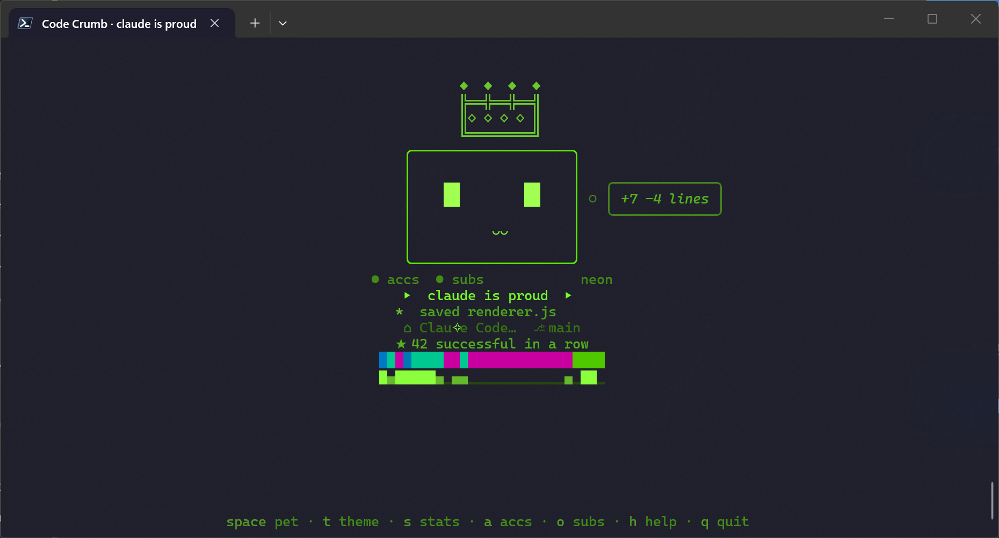
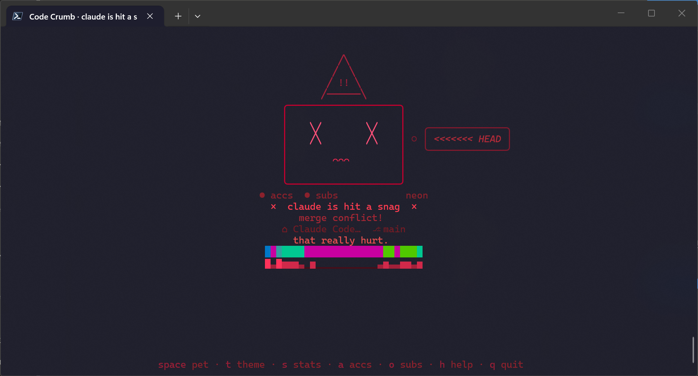
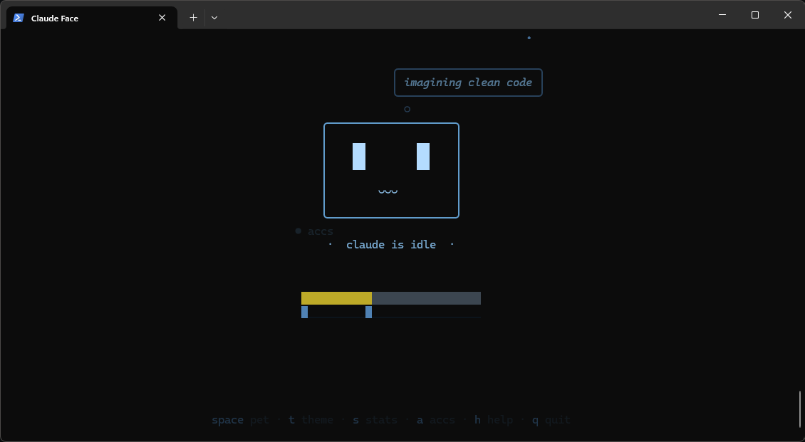
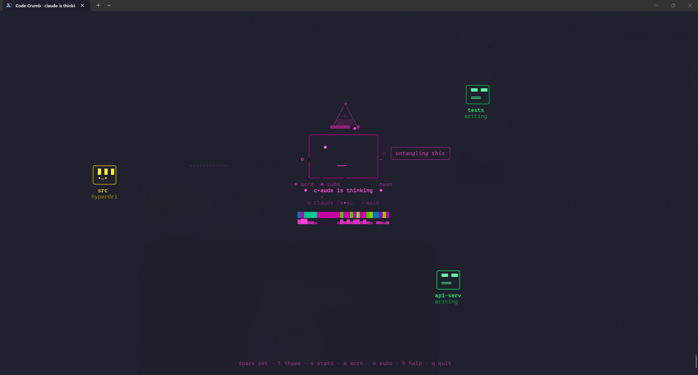
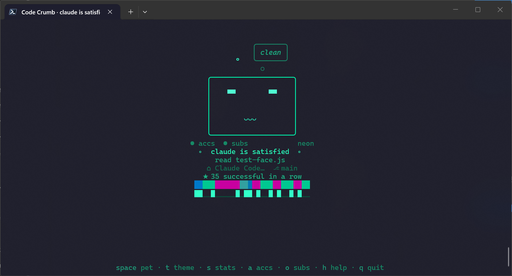
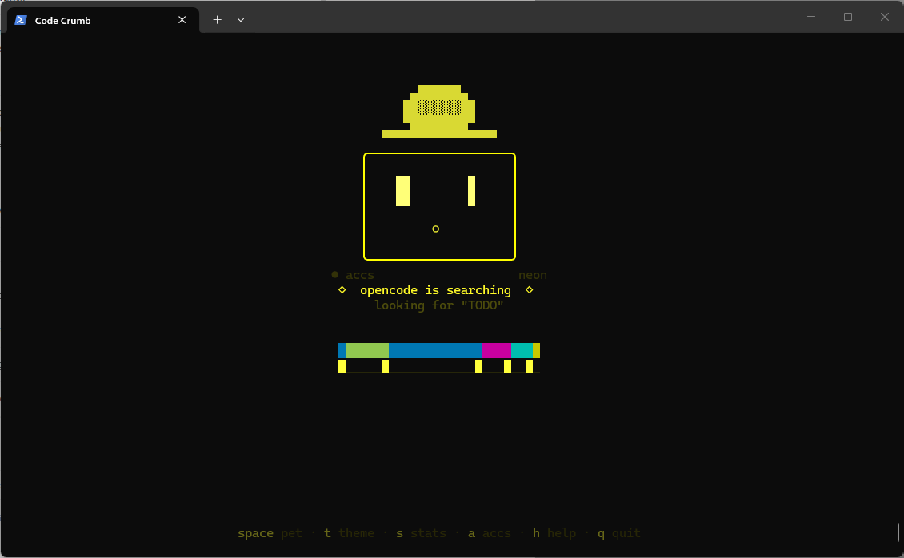
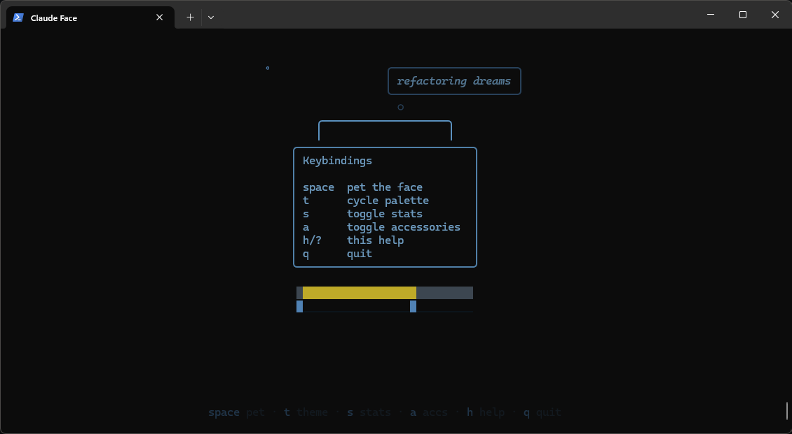

# Code Crumb

[](https://opensource.org/licenses/MIT)
[](https://nodejs.org)
[](#)
[](#)

A terminal tamagotchi that shows what your AI coding assistant is doing.



Code Crumb hooks into AI coding tool lifecycle events and displays an animated ASCII face that reacts in real time — blinking, searching, coding, celebrating, and occasionally glitching when things go wrong. 18 expressive states, 12 particle effects, 5 color palettes, orbital subagent tracking, streak counters, and you can pet it.

**Supported tools:** [Claude Code](https://docs.anthropic.com/en/docs/claude-code), [OpenAI Codex CLI](https://github.com/openai/codex), [OpenCode](https://github.com/sst/opencode), [OpenClaw/Pi](https://github.com/anthropics/claw) — and anything that can pipe JSON events.

Zero dependencies. Just Node.js.

## Quick Start

Requires **Node.js 18+**. Works on **Windows**, **macOS**, and **Linux**.

### Claude Code (marketplace — recommended)

Install directly from the Code Crumb marketplace — no cloning required:

```bash
/plugin marketplace add Skelly0/code-crumb
/plugin install code-crumb@code-crumb
```

Then open a second terminal and run the face:

```bash
node ~/.claude/plugins/cache/code-crumb/*/renderer.js
```

> [!TIP]
> The renderer runs in its own terminal window alongside your editor — it doesn't block anything. If you want a stable path, clone the repo and run `node code-crumb/renderer.js` instead.

### Claude Code (local plugin)

Clone and install as a local plugin:

```bash
git clone https://github.com/Skelly0/code-crumb.git
claude plugin install --plugin-dir ./code-crumb
```

Then run the face in a second terminal:

```bash
node code-crumb/renderer.js
```

That's it. Start coding and the face reacts.

### Claude Code (manual hooks)

If you prefer not to use the plugin system:

```bash
git clone https://github.com/Skelly0/code-crumb.git
node code-crumb/setup.js
node code-crumb/renderer.js   # in a separate terminal
```

> [!TIP]
> Pass `--autolaunch` to have the renderer start automatically whenever your editor fires a hook — no need to open a second terminal manually:
> ```bash
> node code-crumb/setup.js --autolaunch
> ```
> You can also enable it later with `node setup.js --autolaunch`. The setting persists in `~/.code-crumb-prefs.json`.

### Other editors

```bash
git clone https://github.com/Skelly0/code-crumb.git

node code-crumb/setup.js codex        # Codex CLI
node code-crumb/setup.js opencode     # OpenCode
node code-crumb/setup.js openclaw     # OpenClaw/Pi

node code-crumb/renderer.js           # in a separate terminal
```

Add `--autolaunch` to any setup command to skip the manual renderer step entirely.

### Launcher (auto-opens face + editor)

```bash
node code-crumb/launch.js                            # Claude Code
node code-crumb/launch.js --editor codex "fix bug"   # Codex CLI
node code-crumb/launch.js --editor opencode           # OpenCode
node code-crumb/launch.js --editor openclaw            # OpenClaw/Pi
```

### Try the demo

```bash
node code-crumb/demo.js          # Cycles through all 18 states
node code-crumb/grid-demo.js     # Orbital subagent constellation
```

## Features

### Expressions

The face has 18 distinct states — each with unique eyes, mouth, particles, and color:

| State | Face | Trigger |
|---|---|---|
| **Idle** | `██ ██` `◡◡◡` — calm, blinking, floating particles | No activity |
| **Thinking** | `● ●` `───` — orbiting particles, contemplative | Before first tool call |
| **Responding** | `▄▄ ██` `◡◡` — soft teal glow | Generating final response |
| **Reading** | `── ──` `───` — narrowed, focused | `Read`, `View` |
| **Searching** | `██ ██` `○` — eyes darting left and right | `Grep`, `Glob`, `WebFetch` |
| **Coding** | `▀▀ ▀▀` `═══` — determined, in the zone | `Edit`, `Write` |
| **Executing** | `██ ██` `◡◡` — running commands | `Bash` |
| **Happy** | `✦ ✧` `◡◡◡◡◡` — sparkles everywhere, lingers 8s | Session complete |
| **Satisfied** | `▀▀ ▀▀` `◡◡◡` — calm teal glow | Read/search done |
| **Proud** | `▄▄ ██` `◡◡` — green-gold sparkles | Code edit done |
| **Relieved** | `██ ██` `◡` — warm amber, soft exhale | Test/command passed |
| **Error** | `╲╱ ╲╱` `◠◠◠` — border glitches, distress | Non-zero exit code |
| **Sleeping** | `── ──` `~~~` — Zzz particles, deep indigo | 60s idle |
| **Waiting** | `▄▄ ██` `───` — gentle `?` particles | Needs input |
| **Testing** | `██ ██` `═══` — nervous twitches, sweat drops | `jest`, `pytest`, etc. |
| **Installing** | `▄▄` `···` — packages raining down | `npm install`, `pip install` |
| **Caffeinated** | `██` `▪◡▪` — speed lines, jitter | 5+ tool calls in 10s |
| **Subagent** | scanning `═══` — stream particles radiate outward | `Task` / subagent spawn |




### Thought Bubbles

A tiny thought bubble floats above the face with contextual content — file count when editing multiple files, tool call number, session duration, or idle flavor text ("thinking about types", "contemplating recursion").



### Streaks & Achievements

A persistent counter tracks consecutive successful tool calls. The face gets increasingly confident during long streaks, and when a build finally fails, the reaction is proportional — first error after 50 successes? *DEVASTATION.* Milestones at 10, 25, 50, 100, 200, and 500 trigger sparkle celebrations.


### Session Timeline

A thin color-coded bar underneath the face shows a visual history:

```
  ████░░████████▓▓▓▓░░████████████████
```

Purple for thinking, green for coding, red for errors, gold for happy. A tiny EKG for your AI.

### Orbital Subagents

When your session spawns subagents (e.g. Claude Code's `Task` tool), mini-faces orbit the main face like satellites:



- Elliptical orbits, slowly rotating as a constellation
- Faint dotted connection lines pulse outward from the main face
- The main face adopts a **conducting** expression — eyes scanning, stream particles radiating
- Up to 8 orbitals; graceful degradation on small terminals
- Sessions appear when subagents start, linger briefly after they stop, then fade
- Toggle with `o`

### Color Palettes

Five palettes — press `t` to cycle. Preferences persist between sessions.

| Palette | Vibe |
|---|---|
| **default** | Soft purples and blues |
| **neon** | High saturation cyans, magentas, limes |
| **pastel** | Soft pinks, lavenders, mints |
| **mono** | Greyscale |
| **sunset** | Warm oranges, reds, golds, purples |

<p>
  
  
</p>
<p>
  
  
</p>

### Interactive Keybindings

| Key | Action |
|-----|--------|
| `space` | Pet the face (sparkle particles + wiggle) |
| `t` | Cycle color palette |
| `s` | Toggle stats (streak, timeline, sparkline) |
| `a` | Toggle accessories (cat ears, thought bubbles) |
| `o` | Toggle orbital subagents |
| `h` / `?` | Toggle help overlay |
| `q` / Ctrl+C | Quit |



## How It Works

```
┌───────────────┐     state files     ┌──────────────────┐
│  Claude Code   │                     │  ~/.code-crumb-  │
│  Codex CLI     │ ──── writes ────▶  │  state            │
│  OpenCode      │    JSON per         │  sessions/*.json  │
│  OpenClaw/Pi   │    session          │                   │
└───────────────┘                      └────────┬──────────┘
                                                │
                                           fs.watch
                                                │
                                    ┌───────────▼──────────┐
                                    │     renderer.js       │
                                    │     @ 15fps           │
                                    │                       │
                                    │  Main face + orbital  │
                                    │  subagent mini-faces  │
                                    └───────────────────────┘
```

1. **Hooks/adapters** fire on tool use events (PreToolUse, PostToolUse, Stop, Notification)
2. **`update-state.js`** maps tool names to face states and writes JSON state files
3. **Session IDs** isolate the main session from subagent sessions (orbital mini-faces)
4. **`renderer.js`** watches for changes and animates at 15fps

## Editor Integration

### Claude Code

**Plugin install** (recommended): `claude plugin install --plugin-dir ./code-crumb` — hooks into 11 lifecycle events automatically: PreToolUse, PostToolUse, PostToolUseFailure, Stop, Notification, SubagentStart, SubagentStop, TeammateIdle, TaskCompleted, SessionStart, and SessionEnd. Subagent sessions appear as orbital mini-faces.

> [!NOTE]
> Agent teams support requires `CLAUDE_CODE_EXPERIMENTAL_AGENT_TEAMS=1`. When enabled, team members appear in the orbital display with role labels and accent colors.

**Manual hooks**: `node setup.js` installs the core hooks (Pre/PostToolUse, Stop, Notification). See the [manual config](#manual-hook-setup) section for details.

### Codex CLI

Two adapter modes since Codex doesn't have a hook system:

| Mode | Setup | Granularity |
|---|---|---|
| **Notify** | `setup.js codex` | Turn-level (completion only) |
| **Wrapper** | `launch.js --editor codex` | Tool-level (full reactions) |

The wrapper gives richer reactions but only works with `codex exec` (non-interactive).

> [!IMPORTANT]
> The wrapper mode requires `codex exec` — it won't work in interactive Codex sessions. Use notify mode if you need interactive support.

### OpenCode

Uses OpenCode's plugin system. Run `node setup.js opencode` for integration instructions — creates a plugin file that pipes events to the adapter.

### OpenClaw/Pi

Uses Pi's extension system. Run `node setup.js openclaw` for instructions. The adapter supports both Pi-native event names and the generic Code Crumb format.

## Configuration

### Environment Variables

| Variable | Default | Purpose |
|---|---|---|
| `CODE_CRUMB_STATE` | `~/.code-crumb-state` | Override state file path |
| `CODE_CRUMB_MODEL` | `claude` | Display name in status line |
| `CLAUDE_SESSION_ID` | Parent PID | Session identifier |

The status line shows `claude is thinking`, `codex is coding`, etc. Each adapter sets a sensible default. The model name can also be passed via the `model_name` field in event JSON.

### Manual Hook Setup

<details>
<summary>Claude Code — manual hook config</summary>

Add to `~/.claude/settings.json`:

```json
{
  "hooks": {
    "PreToolUse": [{
      "matcher": "",
      "hooks": [{ "type": "command", "command": "node \"/path/to/update-state.js\" PreToolUse" }]
    }],
    "PostToolUse": [{
      "matcher": "",
      "hooks": [{ "type": "command", "command": "node \"/path/to/update-state.js\" PostToolUse" }]
    }],
    "Stop": [{
      "matcher": "",
      "hooks": [{ "type": "command", "command": "node \"/path/to/update-state.js\" Stop" }]
    }],
    "Notification": [{
      "matcher": "",
      "hooks": [{ "type": "command", "command": "node \"/path/to/update-state.js\" Notification" }]
    }]
  }
}
```
</details>

<details>
<summary>Codex CLI — manual config</summary>

Add to `~/.codex/config.toml`:

```toml
notify = ["node", "/path/to/adapters/codex-notify.js"]
```
</details>

### Add to PATH (optional)

**Windows (PowerShell):**
```powershell
function code-crumb { node "C:\path\to\code-crumb\launch.js" @args }
```

**macOS / Linux:**
```bash
chmod +x ~/code-crumb/code-crumb.sh
ln -s ~/code-crumb/code-crumb.sh /usr/local/bin/code-crumb
```

Or: `cd code-crumb && npm link`

## Performance

- Zero dependencies — just Node.js
- ~0.5% CPU at 15fps (even with orbitals)
- Hook script completes in <50ms
- State files are <200 bytes each
- No network, no sockets — all file-based IPC

## Terminal Compatibility

| Terminal | Status |
|---|---|
| Windows Terminal | Full support |
| iTerm2 | Full support |
| VS Code terminal | Full support |
| tmux | Full support |
| macOS Terminal.app | Works (some Unicode may render oddly) |
| ConEmu / cmder | Should work |
| Legacy cmd.exe | No ANSI support — won't render |

> [!WARNING]
> Legacy `cmd.exe` does not support ANSI escape codes and will not render the face. Use Windows Terminal, VS Code terminal, or any modern terminal emulator instead.

<details>
<summary>Project files reference</summary>

| File | Purpose |
|---|---|
| `renderer.js` | Main renderer — face + orbital subagents |
| `update-state.js` | Hook script — maps tool events to face states |
| `launch.js` | Auto-starts renderer and launches editor |
| `setup.js` | Installs hooks for any supported editor |
| `face.js` | ClaudeFace class — state machine and rendering |
| `grid.js` | MiniFace + OrbitalSystem — subagent orbits |
| `animations.js` | Eye/mouth animation functions |
| `particles.js` | ParticleSystem — 12 visual effect styles |
| `themes.js` | ANSI codes, palettes, color math, thought bubbles |
| `state-machine.js` | Tool mapping, error detection, streaks |
| `shared.js` | Shared constants, paths, utilities |
| `adapters/codex-wrapper.js` | Wraps `codex exec --json` for tool-level events |
| `adapters/codex-notify.js` | Handles Codex `notify` config events |
| `adapters/opencode-adapter.js` | OpenCode plugin event adapter |
| `adapters/openclaw-adapter.js` | OpenClaw/Pi event adapter |
| `demo.js` | Cycles through all 18 states |
| `grid-demo.js` | Orbital subagent demo |

</details>

## Uninstall

**Claude Code:** Remove hook entries from `~/.claude/settings.json` (or `claude plugin uninstall code-crumb`)

**Codex:** Remove the `notify` line from `~/.codex/config.toml`

**Clean up state files:**
```bash
rm ~/.code-crumb-state ~/.code-crumb-stats.json ~/.code-crumb.pid ~/.code-crumb-prefs.json
rm -rf ~/.code-crumb-sessions
```

## License

MIT
