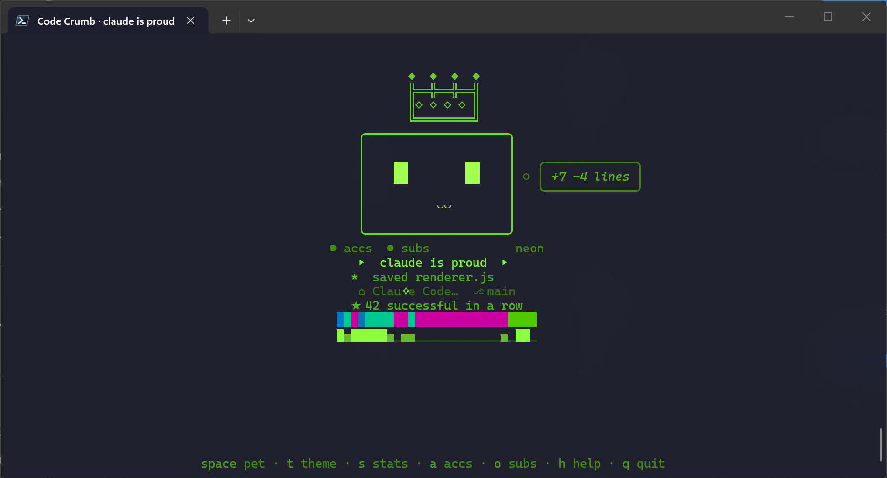
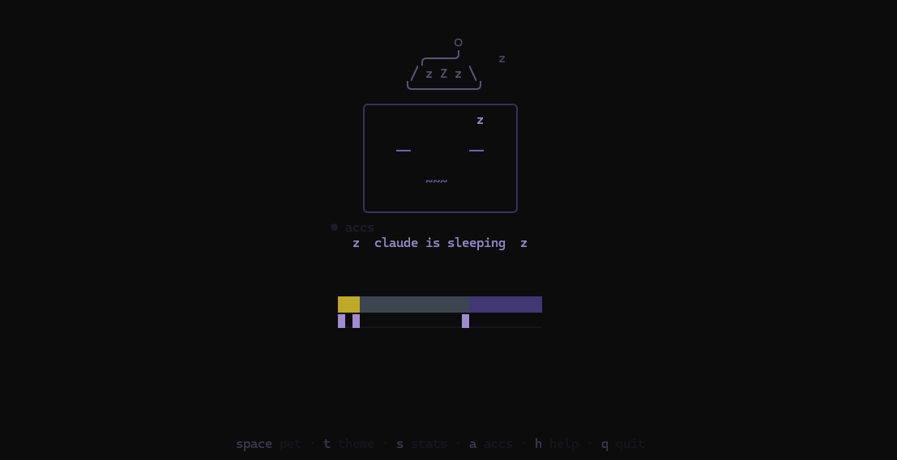
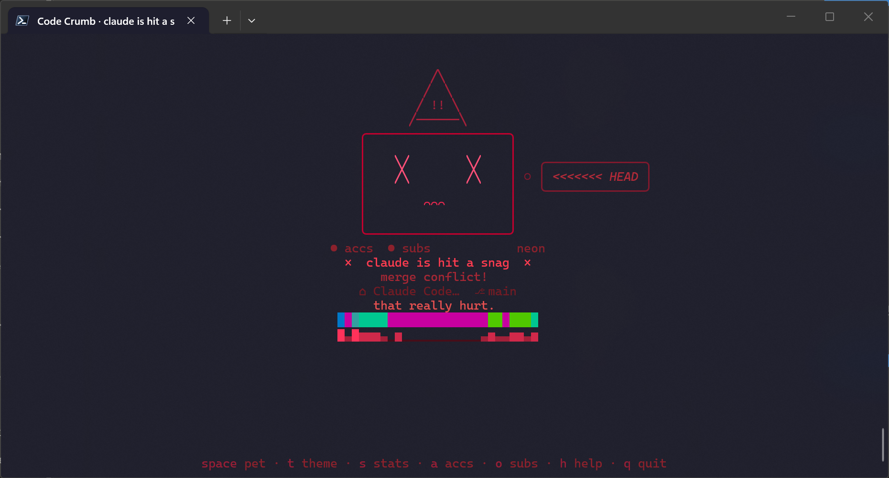
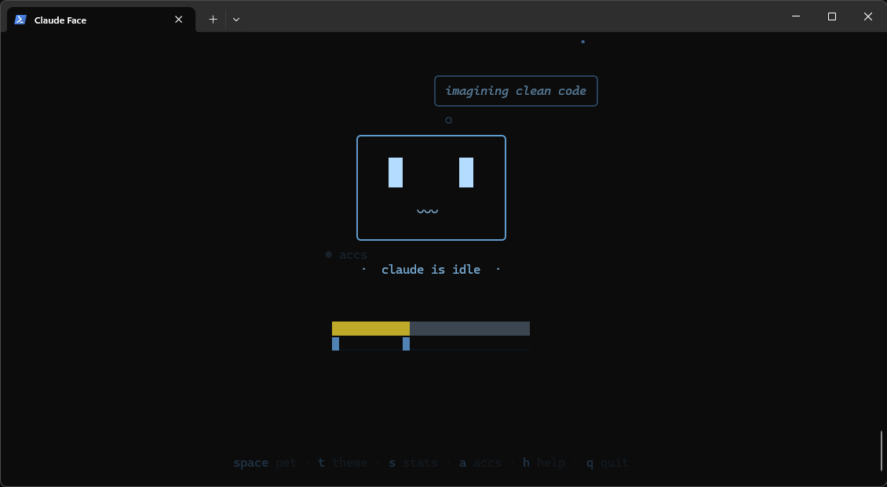
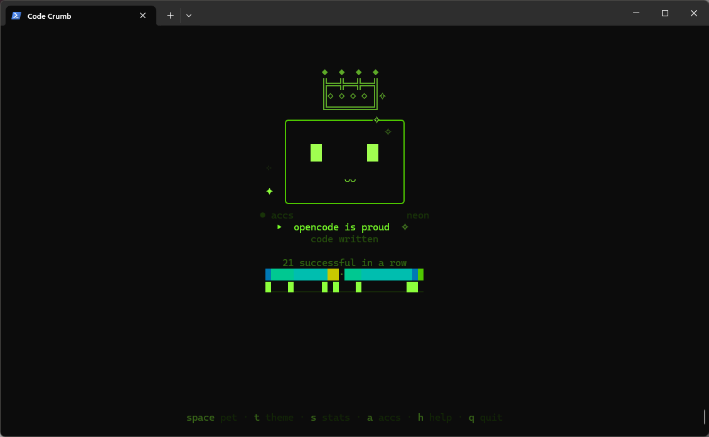
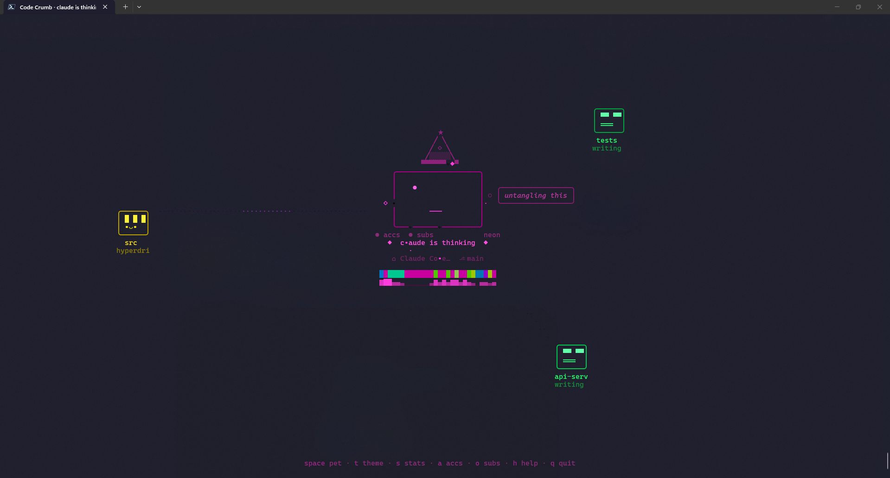
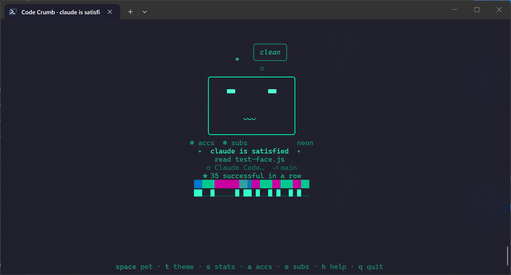
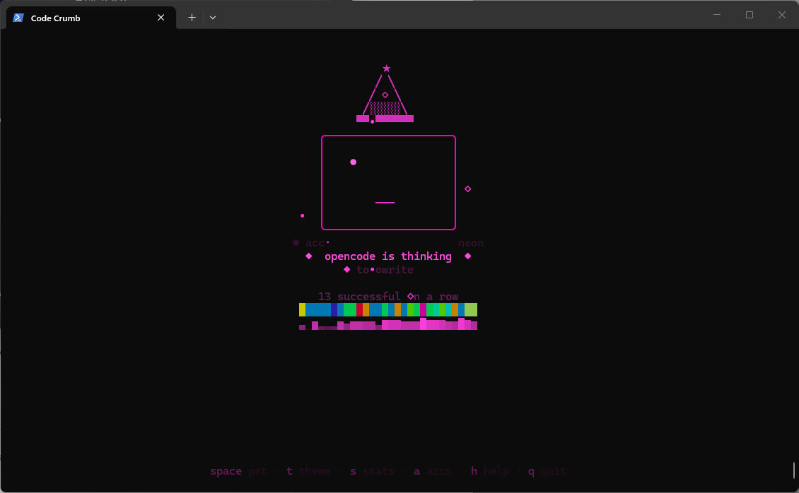
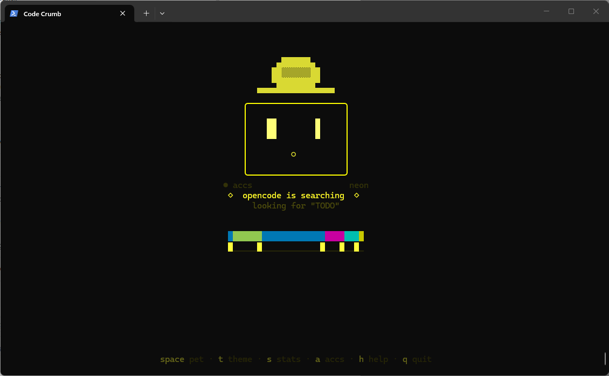
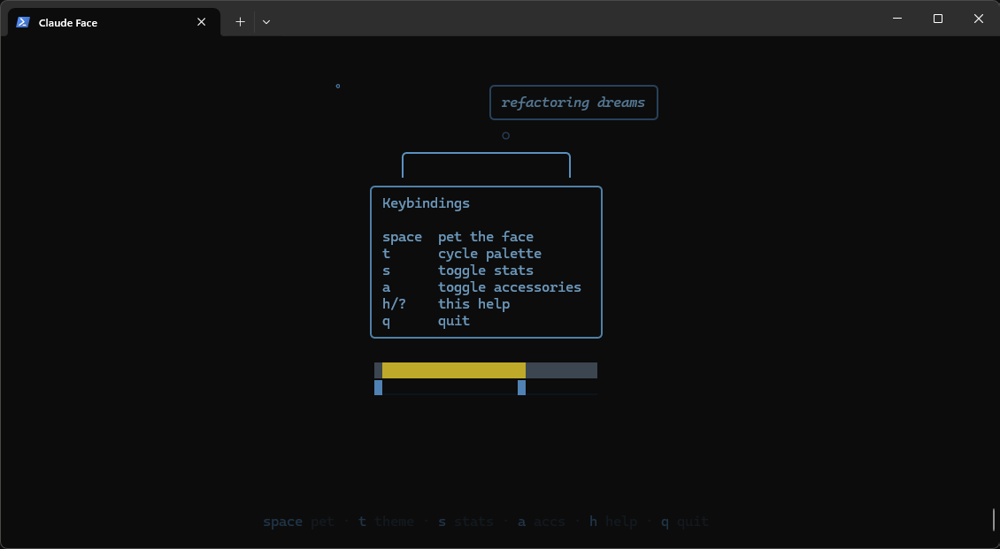

# Code Crumb

[](https://opensource.org/licenses/MIT)
[](https://nodejs.org)
[](#)
[](#)

A terminal tamagotchi that shows what your AI coding assistant is doing.



Code Crumb hooks into AI coding tool lifecycle events and displays an animated ASCII face that reacts in real time — blinking, searching, coding, celebrating, and occasionally glitching when things go wrong. 23 expressive states, 16 particle effects, 6 color palettes, orbital subagent tracking, streak counters, and you can pet it.

**Supported tools:** [Claude Code](https://docs.anthropic.com/en/docs/claude-code), [OpenAI Codex CLI](https://github.com/openai/codex), [OpenCode](https://github.com/sst/opencode), [OpenClaw/Pi](https://github.com/anthropics/claw) — and anything that can pipe JSON events.

Zero dependencies. Just Node.js.

## Quick Start

Requires **Node.js 18+**. Works on **Windows**, **macOS**, and **Linux**.

### Claude Code (marketplace — recommended)

Install directly from the Code Crumb marketplace — no cloning required:

```bash
/plugin marketplace add Skelly0/code-crumb
/plugin install code-crumb@code-crumb
```

Then open a second terminal and run the face:

```bash
node ~/.claude/plugins/cache/code-crumb/*/renderer.js
```

> [!TIP]
> The renderer runs in its own terminal window alongside your editor — it doesn't block anything. If you want a stable path, clone the repo and run `node code-crumb/renderer.js` instead.

### Claude Code (local plugin)

Clone and install as a local plugin:

```bash
git clone https://github.com/Skelly0/code-crumb.git
claude plugin marketplace add ./code-crumb
claude plugin install code-crumb@code-crumb
```

Then run the face in a second terminal:

```bash
node code-crumb/renderer.js
```

That's it. Start coding and the face reacts.

### Claude Code (manual hooks)

If you prefer not to use the plugin system:

```bash
git clone https://github.com/Skelly0/code-crumb.git
node code-crumb/setup.js
node code-crumb/renderer.js   # in a separate terminal
```

> [!TIP]
> Pass `--autolaunch` to have the renderer start automatically whenever your editor fires a hook — no need to open a second terminal manually:
> ```bash
> node code-crumb/setup.js --autolaunch
> ```
> You can also enable it later with `node setup.js --autolaunch`. The setting persists in `~/.code-crumb-prefs.json`.

### Other editors

```bash
git clone https://github.com/Skelly0/code-crumb.git

node code-crumb/setup.js codex              # Codex CLI (native hooks)
node code-crumb/setup.js opencode --install # OpenCode (installs the shipped plugin)
node code-crumb/setup.js openclaw           # OpenClaw/Pi

node code-crumb/renderer.js           # in a separate terminal
```

Add `--autolaunch` to any setup command to skip the manual renderer step entirely.

### Launcher (auto-opens face + editor)

```bash
node code-crumb/launch.js                            # Claude Code
node code-crumb/launch.js --editor codex "fix bug"   # Codex CLI
node code-crumb/launch.js --editor opencode           # OpenCode
node code-crumb/launch.js --editor openclaw            # OpenClaw/Pi
```

### Try the demo

```bash
node code-crumb/demo.js          # Cycles through all 23 states
node code-crumb/grid-demo.js     # Orbital subagent constellation
```

## Features

### Expressions

The face has 23 distinct states — each with unique eyes, mouth, particles, and color:

| State | Face | Trigger |
|---|---|---|
| **Idle** | `██ ██` `◡◡◡` — calm, blinking, floating particles | No activity |
| **Thinking** | `● ●` `───` — orbiting particles, contemplative | You sent a prompt; before the first tool call. Also planning tools (`TodoWrite`, plan mode) |
| **Responding** | `▄▄ ██` `◡◡` — soft teal glow | Generating final response |
| **Reading** | `── ──` `───` — narrowed, focused | `Read`, `NotebookRead`, `Skill`, MCP `read_*`/`get_*`/`list_*` |
| **Searching** | `██ ██` `○` — eyes darting left and right | `Grep`, `Glob`, `LS`, `ToolSearch`, `WebFetch`, MCP `search_*` |
| **Coding** | `▀▀ ▀▀` `═══` — determined, in the zone | `Edit`, `Write`, `NotebookEdit`, `Artifact`, MCP `create_*`/`update_*` |
| **Executing** | `██ ██` `◡◡` — running commands | `Bash`, `PowerShell`, `KillShell`, other MCP tools |
| **Happy** | `✦ ✧` `◡◡◡◡◡` — sparkles everywhere, lingers 8s | Session complete, `Agent`/`Workflow` finished |
| **Satisfied** | `▀▀ ▀▀` `◡◡◡` — calm teal glow | Read/search done, review done, your answer received |
| **Proud** | `▄▄ ██` `◡◡` — green-gold sparkles | Code edit done, commit, artifact published |
| **Relieved** | `██ ██` `◡` — warm amber, soft exhale | Test/command passed |
| **Error** | `╲╱ ╲╱` `◠◠◠` — border glitches, distress | Non-zero exit code, interrupted command, tool failure, API error |
| **Sleeping** | `── ──` `~~~` — Zzz particles, deep indigo | 60s idle |
| **Waiting** | `▄▄ ██` `───` — gentle `?` particles | `AskUserQuestion`, permission prompt, idle prompt, elicitation |
| **Testing** | `██ ██` `═══` — nervous twitches, sweat drops | `jest`, `pytest`, etc. |
| **Installing** | `▄▄` `···` — packages raining down | `npm install`, `pip install` |
| **Caffeinated** | `██` `▪◡▪` — speed lines, jitter | 5+ tool calls in 10s |
| **Subagent** | scanning `═══` — stream particles radiate outward | `Agent` / `Task` / `Workflow`, checking on agents |
| **Starting** | `▄▄ ██` `◡◡` — fresh session glow | Session begins |
| **Spawning** | `██ ██` `○` — materialization particles | Subagent launching |
| **Committing** | `▀▀ ▀▀` `═══` — push particles upward | `git commit` / `push` / `tag` |
| **Reviewing** | `── ──` `───` — careful scanning | `ReportFindings`, diff / review tools |
| **Training** | `● ●` `═══` — pulsing concentration | ML training runs |

Reward faces (happy, proud, satisfied, relieved) are guaranteed at least 1.8s on screen before the next tool takes over; errors always preempt and hold for 4s. Work faces update live as tools run.

**A tool that runs for a long time keeps its work face.** A single `Bash` can run for minutes with no further event, so instead of drifting back to *thinking* the face holds — the detail line counts up (`still running … 42s`) and after 20 seconds the face starts to sweat.

**If Code Crumb has been waiting on you for more than 30 seconds it gets louder** — big bold question marks, a counter on the detail line, a pulsing status line, and a flashing terminal title so you notice from another window.





### Thought Bubbles

A tiny thought bubble floats above the face with contextual content — file count when editing multiple files, tool call number, session duration, or idle flavor text ("thinking about types", "contemplating recursion").



### Streaks & Achievements

A persistent counter tracks consecutive successful tool calls. The face gets increasingly confident during long streaks, and when a build finally fails, the reaction is proportional — first error after 50 successes? *DEVASTATION.* Milestones at 10, 25, 50, 100, 200, and 500 trigger sparkle celebrations.



### Session Timeline

A thin color-coded bar underneath the face shows a visual history:

```
  ████░░████████▓▓▓▓░░████████████████
```

Purple for thinking, green for coding, red for errors, gold for happy. A tiny EKG for your AI.

### Orbital Subagents

When your session spawns subagents (e.g. Claude Code's `Task` tool), mini-faces orbit the main face like satellites:



- **Every Claude Code subagent gets its own orbital**, labelled from its prompt (or its agent type — `Explore`, `Plan`, a custom agent name)
- Elliptical orbits, slowly rotating as a constellation
- Faint dotted connection lines pulse outward from the main face
- The main face adopts a **conducting** expression — eyes scanning, stream particles radiating — and holds it for as long as agents are alive, instead of dozing off while they work
- Up to 8 orbitals; graceful degradation on small terminals
- Sessions appear when subagents start, linger briefly after they stop, then fade
- Toggle with `o`

**Which face is in the center?** The center follows your attention: the session you most recently sent a prompt to. Start a new window or type in an old one and the big face swaps to it (a `SessionStart` from `/compact` does not count). Promoting a session from the list (`l`, then `Enter`) pins it there, shown as `⊛`; the pin releases by itself when that session ends or goes quiet, and `Enter` on the main row un-pins it. Each entry in the list has an info row: tool and file counts with the age of the last write for a session, agent type with its parent for a subagent.

### Color Palettes

Six palettes — press `t` to cycle. Preferences persist between sessions.

| Palette | Vibe |
|---|---|
| **default** | Soft purples and blues |
| **neon** | High saturation cyans, magentas, limes |
| **pastel** | Soft pinks, lavenders, mints |
| **mono** | Greyscale |
| **sunset** | Warm oranges, reds, golds, purples |
| **highcontrast** | Accessibility palette — maximum contrast, no subtle dims |

<p>
  
  
</p>
<p>
  
  
</p>

### Interactive Keybindings

| Key | Action |
|-----|--------|
| `space` | Pet the face (sparkle particles + wiggle) |
| `t` | Cycle color palette |
| `s` | Toggle stats (streak, timeline, sparkline) |
| `a` | Toggle accessories (hats, glasses, ears — thought bubbles stay on) |
| `o` | Toggle orbital subagents |
| `l` | Open session list |
| `↑↓` / `j/k` | Navigate session list |
| `Enter` | On the main row: pin / unpin it. On any other row: pin and promote it to the center |
| `h` / `?` | Toggle help overlay |
| `q` / Ctrl+C | Quit |

Any key closes the help overlay or the session list. `t` is disabled when `NO_COLOR` is set. In minimal mode (`--minimal`) only `space` and `q` are active.



## How It Works

```
┌────────────────┐     state files     ┌───────────────────┐
│  Claude Code   │                     │  ~/.code-crumb-   │
│  Codex CLI     │ ──── writes ────▶  │  state            │
│  OpenCode      │    JSON per         │  sessions/*.json  │
│  OpenClaw/Pi   │    session          │                   │
└────────────────┘                     └────────┬──────────┘
                                                │
                                           fs.watch
                                                │
                                    ┌───────────▼──────────┐
                                    │     renderer.js       │
                                    │     @ 15fps           │
                                    │                       │
                                    │  Main face + orbital  │
                                    │  subagent mini-faces  │
                                    └───────────────────────┘
```

1. **Hooks/adapters** fire on lifecycle events (21 for Claude Code: your prompt, tool use, Stop, notifications, subagents, sessions, compaction, permissions, and more)
2. **`update-state.js`** maps tool names and results to face states and writes JSON state files (atomically — the renderer never sees a half-written file)
3. **Session IDs** isolate the main session from subagent sessions (orbital mini-faces). Claude Code subagents report under the parent's session id, so they are separated by `agent_id` and each gets its own orbital file
4. **`renderer.js`** watches for changes and animates at 15fps

## Editor Integration

### Claude Code

**Plugin install** (recommended): `claude plugin marketplace add ./code-crumb` then `claude plugin install code-crumb@code-crumb` — hooks into all 21 lifecycle events automatically: PreToolUse, PostToolUse, PostToolUseFailure, UserPromptSubmit, Stop, StopFailure, Notification, PermissionRequest, Elicitation, ElicitationResult, SubagentStart, SubagentStop, TeammateIdle, TaskCompleted, SessionStart, SessionEnd, PreCompact, PostCompact, Setup, ConfigChange, and InstructionsLoaded. Subagent sessions appear as orbital mini-faces.

> [!NOTE]
> Agent teams support requires `CLAUDE_CODE_EXPERIMENTAL_AGENT_TEAMS=1`. When enabled, team members appear in the orbital display with role labels and accent colors.

**Manual hooks**: `node setup.js` writes the same 21 hooks into `~/.claude/settings.json` (backing the file up to `settings.json.bak` first and refusing to touch a file it cannot parse). `node setup.js uninstall` removes them again. Use either the plugin or the manual hooks, not both — with both installed every event fires twice. See the [manual config](#manual-hook-setup) section for the JSON shape.

### Codex CLI

Codex has **native hooks** now, so it uses the same handler Claude Code does. That is the primary integration:

```bash
node setup.js codex        # writes ~/.codex/hooks.json (backing it up first)
```

Codex asks for a one-time trust confirmation the first time hooks fire; approve it and you're done. This works in interactive TUI sessions.

| Mode | Setup | Granularity | Works with |
|---|---|---|---|
| **Hooks** (recommended) | `setup.js codex` | Tool-level | Interactive + `codex exec` |
| **Wrapper** | `launch.js --editor codex` | Tool-level | `codex exec` only — no trust prompt |
| **Notify** (legacy) | `setup.js codex-notify` | Turn-level (completion only) | Any |

Codex fires 10 of the 21 lifecycle events (`PreToolUse`, `PostToolUse`, `PermissionRequest`, `PreCompact`, `SessionStart`, `SessionEnd`, `SubagentStart`, `SubagentStop`, `UserPromptSubmit`, `Stop`) — it has no `Notification` and no `PostToolUseFailure`, and setup registers exactly the ten it does fire. The wrapper parses `codex exec --json` against codex-cli 0.146's ThreadEvent schema.

> [!NOTE]
> Upgrading from an older Code Crumb? Re-run `node setup.js codex`. A hooks file migrated from `~/.claude/settings.json` by hand has no `--editor codex` tag (so Codex sessions render as "claude") and may register a `Notification` event Codex never fires. Re-running rewrites every entry and prunes the unsupported one.

### OpenCode

Code Crumb ships a real OpenCode plugin. Install it and start the renderer:

```bash
node setup.js opencode --install     # adds the plugin to ~/.config/opencode/opencode.json
node renderer.js                     # in a separate terminal
```

Or add it by hand — note the config key is `plugin`, **not** `plugins`:

```json
{ "plugin": ["/absolute/path/to/code-crumb/adapters/opencode-plugin.mjs"] }
```

`node setup.js opencode --uninstall` removes the entry again.

> [!WARNING]
> If you followed the old instructions you have a hand-written `~/.config/opencode/plugins/code-crumb.js` and a `"plugin": ["./plugins/code-crumb.js"]` entry. **Delete both.** That file targets an API OpenCode no longer has — it never receives a session id and its tool input is always empty, which is what produced phantom orbitals (#120). Leaving the old entry alongside the new one makes every event fire twice.

> [!TIP]
> If `node` is not on `PATH` inside OpenCode, set `CODE_CRUMB_NODE` to the node binary — `process.execPath` inside OpenCode is the Bun binary, so the plugin cannot use it.

### OpenClaw/Pi

Uses Pi's extension system. Run `node setup.js openclaw` for instructions. The adapter supports both Pi-native event names and the generic Code Crumb format.

## Configuration

### Environment Variables

| Variable | Default | Purpose |
|---|---|---|
| `CODE_CRUMB_STATE` | `~/.code-crumb-state` | Override state file path |
| `CODE_CRUMB_MODEL` | `claude` | Display name in status line |
| `CODE_CRUMB_EDITOR` | `claude` (adapters set their own) | Editor tag shown in the session list; beats the `--editor` hook argument |
| `CODE_CRUMB_NODE` | `node` | Node binary the OpenCode plugin spawns for the adapter |
| `CLAUDE_SESSION_ID` | `<editor>-<parent PID>` | Session identifier |
| `NO_COLOR` | unset | Disable colour output (also disables the `t` key) |
| `MINIMAL_BOOT` | unset | Start in minimal mode (same as `--minimal`) |
| `CLAUDE_CODE_EXPERIMENTAL_AGENT_TEAMS` | unset | `1` enables agent-team orbitals |

Renderer flags: `--minimal` (face + status only), `--tmux` (write a status line for tmux instead of drawing), `--no-color`.

The status line shows `claude is thinking`, `codex is coding`, etc. Each adapter sets a sensible default. The model name can also be passed via the `model_name` field in event JSON.

### Manual Hook Setup

<details>
<summary>Claude Code — manual hook config</summary>

Add to `~/.claude/settings.json` (this shows four of the 21 events; repeat the block for the others, or let `node setup.js` write them all):

```json
{
  "hooks": {
    "PreToolUse": [{
      "matcher": "",
      "hooks": [{ "type": "command", "command": "node \"/path/to/update-state.js\" PreToolUse" }]
    }],
    "PostToolUse": [{
      "matcher": "",
      "hooks": [{ "type": "command", "command": "node \"/path/to/update-state.js\" PostToolUse" }]
    }],
    "Stop": [{
      "matcher": "",
      "hooks": [{ "type": "command", "command": "node \"/path/to/update-state.js\" Stop" }]
    }],
    "Notification": [{
      "matcher": "",
      "hooks": [{ "type": "command", "command": "node \"/path/to/update-state.js\" Notification" }]
    }]
  }
}
```
</details>

<details>
<summary>Codex CLI — manual config</summary>

Add to `~/.codex/config.toml`:

```toml
notify = ["node", "/path/to/adapters/codex-notify.js"]
```
</details>

### Add to PATH (optional)

**Windows (PowerShell):**
```powershell
function code-crumb { node "C:\path\to\code-crumb\launch.js" @args }
```

**macOS / Linux:**
```bash
chmod +x ~/code-crumb/code-crumb.sh
ln -s ~/code-crumb/code-crumb.sh /usr/local/bin/code-crumb
```

Or: `cd code-crumb && npm link`

## Performance

- Zero dependencies — just Node.js
- ~0.5% CPU at 15fps (even with orbitals)
- Hook script completes in <50ms
- State files are ~1 KB each, written atomically
- No network, no sockets — all file-based IPC

## Terminal Compatibility

| Terminal | Status |
|---|---|
| Windows Terminal | Full support |
| iTerm2 | Full support |
| VS Code terminal | Full support |
| tmux | Full support |
| macOS Terminal.app | Works (some Unicode may render oddly) |
| ConEmu / cmder | Should work |
| Legacy cmd.exe | No ANSI support — won't render |

> [!WARNING]
> Legacy `cmd.exe` does not support ANSI escape codes and will not render the face. Use Windows Terminal, VS Code terminal, or any modern terminal emulator instead.

<details>
<summary>Project files reference</summary>

| File | Purpose |
|---|---|
| `renderer.js` | Main renderer — face + orbital subagents |
| `update-state.js` | Hook script — maps tool events to face states |
| `launch.js` | Auto-starts renderer and launches editor |
| `setup.js` | Installs hooks for any supported editor |
| `face.js` | ClaudeFace class — state machine and rendering |
| `grid.js` | MiniFace + OrbitalSystem — subagent orbits |
| `animations.js` | Eye/mouth animation functions |
| `particles.js` | ParticleSystem — 16 visual effect styles |
| `themes.js` | ANSI codes, palettes, color math, thought bubbles |
| `state-machine.js` | Tool mapping, error detection, streaks |
| `shared.js` | Shared constants, paths, utilities |
| `transition.js` | SwapTransition — dissolve/swap/materialize animations |
| `accessories.js` | Accessory definitions (hats, glasses, ears) and rendering |
| `adapters/base-adapter.js` | Base adapter class with shared functionality |
| `adapters/codex-wrapper.js` | Wraps `codex exec --json` for tool-level events |
| `adapters/codex-notify.js` | Handles Codex's legacy `notify` config events |
| `adapters/opencode-plugin.mjs` | The shipped OpenCode plugin (ESM) |
| `adapters/opencode-adapter.js` | OpenCode plugin event adapter |
| `adapters/openclaw-adapter.js` | OpenClaw/Pi event adapter |
| `adapters/engmux-adapter.js` | engmux agent dispatcher event adapter |
| `hooks/hooks.json` | Hook registrations used by the Claude Code plugin |
| `code-crumb.sh` / `code-crumb.cmd` | Shell wrappers around `launch.js` |
| `demo.js` | Cycles through all 23 states |
| `grid-demo.js` | Orbital subagent demo |
| `test.js`, `tests/` | Test runner and suite (`npm test`) |

</details>

## Uninstall

**Claude Code:** `node setup.js uninstall` removes the manual hooks (or `claude plugin uninstall code-crumb` for the plugin)

**Codex:** `node setup.js uninstall` removes the Codex hooks from `~/.codex/hooks.json` as well as the Claude Code ones. For the legacy notify mode, remove the `notify` line from `~/.codex/config.toml`.

**OpenCode:** `node setup.js opencode --uninstall` removes the plugin entry from `~/.config/opencode/opencode.json`.

**Clean up state files:**
```bash
rm ~/.code-crumb-state ~/.code-crumb-stats.json ~/.code-crumb.pid ~/.code-crumb-prefs.json
rm -f ~/.code-crumb-spawn.lock ~/.code-crumb-stats.lock
rm -rf ~/.code-crumb-sessions
```

## License

MIT
